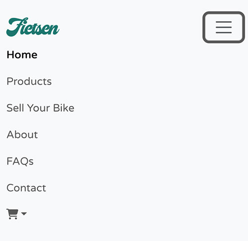
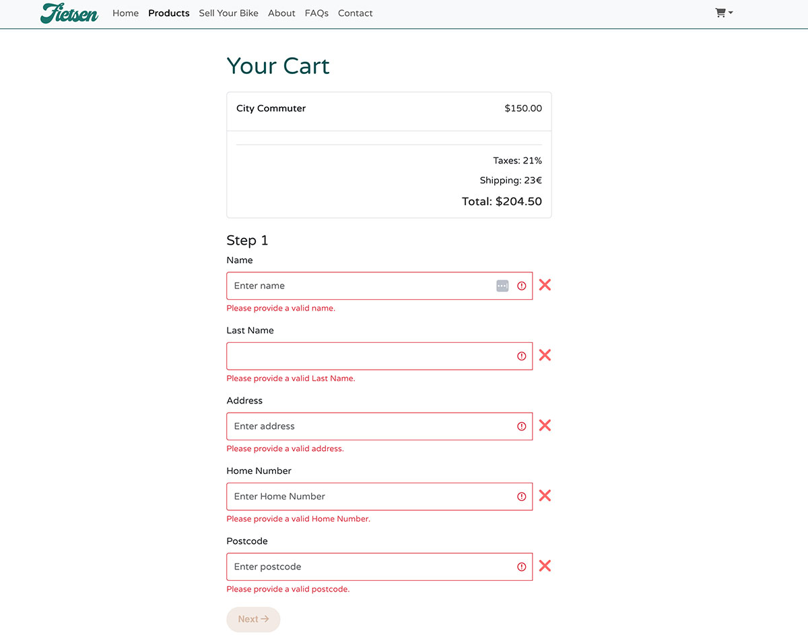

# Fietsen, ecommerce in React

## Table of Contents
1. [Features](#features)
2. [Existing Features and Features to Implement](#existing-features-and-features-to-implement)
3. [Technologies](#technologies)
4. [Components](#components)
5. [User Stories](#user-stories)
6. [User Flow](#user-flow)
7. [Wireframes](#wireframes)
8. [Testing](#testing)
9. [Deployment](#deployment)
10. [Credits](#credits)


This React-based platform stands out as a unique second-hand Dutch bike ecommerce site, combining easy product discovery, detailed insights, and smooth shopping in an appealing and functional online environment. It guides users with a dynamic navigation bar and a welcoming Hero section to a select range of Dutch bikes and accessories. The site makes finding and buying pre-owned bicycles straightforward with an intuitive Product Search and detailed Product Pages, supported by a comprehensive FAQ, an engaging About page, and a direct Contact form. It invites users to engage by selling their bikes, and features a Generic Banner for news and a Footer for easy navigation, emphasizing transparency and trust with a Cookie Consent feature. Beyond being a shopping site, it's a community hub for Dutch cycling enthusiasts, promoting a more connected cycling community with every interaction.

Live webpage [here](https://igordinuzzi.github.io/ecommerce-site-react/)

Watch video [here](https://youtu.be/QtNMasooneU)

# Features

- ## Navigation:
This React component features adaptive navigation with comprehensive links for smooth browsing across devices, enhancing user engagement and satisfaction. Using React Router and Bootstrap, it offers meticulously structured navigation for easy location of information, products, or services, improving usability and user retention. The NavBar component, with dynamic cart animations and easy cart access, serves as a key user touchpoint, combining functionality and aesthetics. It uses FontAwesome icons and a collapsible design to keep navigation user-friendly and fluid on all platforms.
 
 
  
- ## Footer: 
The site's footer enhances user experience by offering social media links to Facebook, Twitter, and Instagram for community engagement, a clear navigation menu for easy access to essential pages like Home and Contact, and an email link for direct communication. It also promotes the site's mobile app with links to Google Play and the Apple App Store for on-the-go access. Styled with custom CSS and FontAwesome icons, this React component strengthens the brand's presence and commitment to accessibility and convenience.
  
  

- ## Favicon for easy recognition.
The favicon is important in a webpage as it provides a recognizable visual identity in browser tabs, 
enhancing brand visibility and user recognition, and it helps users quickly locate and return to the site.
  
  
- ## Landing page 
This React application offers streamlined navigation with a fluid layout, guiding users from a welcoming Hero component to various sections like Products and About via a NavBar. It features a ProductList for browsing second-hand Dutch bikes and accessories, enhanced by a ProductSearch for refined exploration. Detailed product information is available through the ProductDetail component, including add-to-cart options. The interface promotes interactivity with notifications for cart updates and a Cart page summarizing purchases. Users can list their bikes for sale with the SellBikeForm, contributing to the cycling community. Informative sections provide insights into the platform's mission, with a GenericBanner for special announcements. The design is responsive across devices, with a Footer that offers social media links, app store downloads, and navigation, emphasizing the brand and community ethos. CookieConsent integration ensures user privacy, creating a comprehensive experience for Dutch bike enthusiasts.
    
```javascript
function App() {
  const [cartItems, setCartItems] = useState([]);
  const [message, setMessage] = useState('');
  const [searchTerm, setSearchTerm] = useState('');
  const productListRef = useRef(null);

  useEffect(() => {
    if (message !== '') {
      const timer = setTimeout(() => setMessage(''), 2000);
      return () => clearTimeout(timer);
    }
  }, [message]);

  const addToCart = (product) => {
    const productWithImage = { ...product, image: 'product-image-url.jpg' };
    setCartItems([...cartItems, productWithImage]);
    setMessage(`Added "${product.name}" to the cart!`); // Set message when item is added
  };

  const onRemoveItem = (index) => {
    const productRemoved = cartItems[index].name;
    const newCartItems = cartItems.filter((item, itemIndex) => itemIndex !== index);
    setCartItems(newCartItems);
    setMessage(`Removed "${productRemoved}" from the cart.`); // Set message when item is removed
  };

  const scrollToProductList = () => {
    productListRef.current.scrollIntoView({ behavior: 'smooth' });
  };

  const handleSearch = (term) => {
    setSearchTerm(term);
  };
}
```

- ## About page

The `About` component in this React application presents Fitsen, a platform for Dutch bicycles, highlighting its mission, values, and offerings. Key features include:

Introduction: Introduces Fitsen and its mission for a sustainable, quality-driven cycling community.
Visuals: Incorporates responsive images of the Fitsen office and Dutch bikes.
Values Section: Displays core values (sustainability, quality, community) with FontAwesome icons.
History: Briefly outlines Fitsen's origins and development.
Testimonials Carousel: Features customer testimonials to build trust.
News Section: Showcases updates and stories in a card layout.
Contact Info: Encourages user engagement with contact details.

Styled with custom CSS and using React Bootstrap for responsive layout, plus FontAwesome icons for visual enhancement, this component effectively conveys Fitsen's ethos and invites user interaction.

```javascript
{/* Customer Testimonials Section */}
      <Carousel className="testimonials-carousel">
        <Carousel.Item>
          <Row className="justify-content-center">
            <Col md={6} className="text-center">
              
              <blockquote className="testimonial-text">"I love my new Dutch bike from Fitsen! Great quality and service."</blockquote>
              <p className="testimonial-name">Araceli</p>
            </Col>
          </Row>
        </Carousel.Item>
        <Carousel.Item>
          <Row className="justify-content-center">
            <Col md={6} className="text-center">
              
              <blockquote className="testimonial-text">"Fitsen made it easy to find the perfect bike for my city commutes."</blockquote>
              <p className="testimonial-name">Marie</p>
            </Col>
          </Row>
        </Carousel.Item>
        {/* Add more Carousel.Items as needed */}
      </Carousel>
```
- ## Cart


The `Cart` component in this React application manages the checkout process for a shopping cart, including form validation and stepwise navigation. It uses `useState` for managing form data, errors, and the current step in the checkout process, and `useEffect` to calculate the total price based on cart items, taxes, and shipping costs. The component features:

Cart Item Listing: Dynamically lists items in the cart with prices.
Form Validation: Validates form fields with regular expressions and updates state based on user input.
Stepwise Navigation: Allows users to navigate through the checkout process in steps, with validation checks at each step.
Form Submission: Handles form submission with validation check, showing an alert if the form is not valid.
Visual Feedback: Uses FontAwesome icons to provide visual feedback on field validation.
Dynamic Form Rendering: Renders form fields based on the current step, including a custom component for payment options in the final step.

The component is styled with `Cart.css` and uses Bootstrap for layout and components like `Container`, `Form`, `Button`, `Alert`, and `ListGroup`. It also includes a `PaymentOptionsImages` component to display payment options during the final step of the checkout process.

```javascript
function Cart({ cartItems }) {
  const [currentStep, setCurrentStep] = useState(1);
  const [formData, setFormData] = useState({
    name: '',
    lastname: ' ', // Initial value with a space
    address: '',
    homenumber: '',
    postcode: '',
    phone: '+31 ',
    email: '',
  });
  const [formErrors, setFormErrors] = useState({});
  const [totalPrice, setTotalPrice] = useState(0);


  useEffect(() => {
    const cartTotal = cartItems.reduce((total, item) => total + item.price, 0);
    const taxes = cartTotal * 0.21;
    const shipping = 23;
    setTotalPrice(cartTotal + taxes + shipping);
  }, [cartItems]);

  const renderCartItems = () => {
    return cartItems.map((item, index) => (
      <ListGroup.Item key={item.id || index}>
        <div className="cart-item">
          <div className="cart-item-name">{item.name}</div>
          <div className="cart-item-price">${item.price.toFixed(2)}</div>
        </div>
      </ListGroup.Item>
    ));
  };

  const handleChange = (e) => {
    const { name, value } = e.target;
    setFormData({ ...formData, [name]: value });
    validateField(name, value);
  };

  const validateField = (name, value) => {
    let isValid = true;
    switch (name) {
      case 'name':
        isValid = /^[a-zA-Z ]+$/.test(value);
        break;
      case 'address':
        isValid = /^[a-zA-Z ]+$/.test(value);
        break;
      case 'postcode':
        isValid = /^\d+$/.test(value);
        break;
      case 'phone':
        isValid = /^\+31 \d+$/.test(value);
        break;
      case 'lastname':
        isValid = /^[a-zA-Z ]+$/.test(value);
        break;
      case 'homenumber':
          isValid = /^\d+$/.test(value);
          break;
      case 'email':
      // Use a regular expression to validate the email format
      isValid = /^[a-zA-Z0-9._-]+@[a-zA-Z0-9.-]+\.[a-zA-Z]{2,4}$/.test(value);
      break;      
      default:
        isValid = value.trim() !== '';
    }
    setFormErrors({ ...formErrors, [name]: isValid });
  };

  const isFormValid = () => {
    return Object.values(formErrors).every((v) => v === true) && Object.keys(formErrors).length === Object.keys(formData).length;
  };

  const handleSubmit = (e) => {
    e.preventDefault();
    // Use isFormValid here to ensure entire form is valid before submission
    if(isFormValid()) {
      // Implement submission logic here
      alert('Form submitted');
    } else {
      // Optionally handle the case where the form is somehow not valid at submission
      alert('Please ensure all form fields are correctly filled and valid.');
    }
  };
  
  const nextStep = () => {
    if (currentStep < 3) {
      setCurrentStep(currentStep + 1);
    }
  };

  const prevStep = () => {
    if (currentStep > 1) {
      setCurrentStep(currentStep - 1);
    }
  };

  const steps = [
    { title: 'Step 1', fields: ['name', 'lastname', 'address', 'homenumber', 'postcode'], contentType: 'formFields' },
    { title: 'Step 2', fields: ['phone', 'email'], contentType: 'formFields' },
    { title: 'Step 3', contentType: 'images' },
  ];
  
  const handleBlur = (fieldName) => {
    // Implement your field blur logic here
  };

  const isFieldTouched = (fieldName) => {
    // Implement your field touched logic here
    return true; // Placeholder, modify as needed
  };

  const isStepValid = () => {
    // Check if the current step has fields defined
    if (steps[currentStep - 1].fields) {
      const currentStepFields = steps[currentStep - 1].fields;
      const fieldsValid = currentStepFields.every((field) => formErrors[field] === true);
      const fieldsFilled = currentStepFields.every((field) => formData[field].trim() !== '');
      return fieldsValid && fieldsFilled;
    } else {
      // If no fields are defined for the step, consider the validation requirement met
      // You might want to adjust this logic based on your app's needs
      return true;
    }
  };
```

- ## Contact

The `Contact` component in this React application provides a user-friendly form for visitors to submit their contact information and messages. It utilizes `useState` to manage form data, sending status, and error messages. The form includes fields for the user's name, email, and a message, with basic validation to ensure no fields are left empty. Upon submission, it displays either a sending status or an error message based on input validation. The form is styled with a custom CSS file (`Contact.css`) and uses React Bootstrap components like `Container`, `Form`, `Button`, and `Alert` for layout and styling. The submission logic, intended for integration with Netlify's form handling, can be easily adapted for other backends or form processing solutions.

- ## Cookies

The `CookieConsent` component in this React application displays a modal window to inform users about the use of cookies on the website. It utilizes `useState` to control the visibility of the modal and `useEffect` to determine whether the user has previously given consent for cookies, leveraging `localStorage` to store this consent status. If the user has not given consent (`cookieConsent` not set to 'true' in `localStorage`), the modal is shown. The modal includes a message about cookie usage and an "I Agree" button. Clicking this button hides the modal and records the user's consent by setting `cookieConsent` to 'true' in `localStorage`. The component is styled with a custom CSS file (`CookieConsent.css`) and uses React Bootstrap components `Modal` and `Button` for the modal dialog and consent button, respectively.
```javascript
const CookieConsent = () => {
  const [show, setShow] = useState(false);

  useEffect(() => {
    const consentGiven = localStorage.getItem('cookieConsent');
    if (consentGiven !== 'true') {
      setShow(true);
    }
  }, []);

  const handleClose = () => {
    setShow(false);
    localStorage.setItem('cookieConsent', 'true');
  };
```

- ## FAQs

The `FAQ` component provides an interactive Frequently Asked Questions section using React Bootstrap, featuring a dynamic list of questions and answers from an array (`faqData`). It includes a search function that filters FAQs based on user input, displayed in an accordion format for easy navigation. The component is responsive, ensuring compatibility across devices, and styled with a custom CSS file (`FAQ.css`). This setup enhances user experience by offering quick access to common queries and supporting efficient information retrieval within the application.
```javascript
function FAQ() {
  const [searchTerm, setSearchTerm] = useState('');

  const handleSearch = (e) => {
    setSearchTerm(e.target.value);
  };

  const filteredFaqs = faqData.filter(faq =>
    faq.question.toLowerCase().includes(searchTerm.toLowerCase())
  );
```

- ## Generic Banner

The `GenericBanner` component is a versatile and visually engaging part of a React application, designed to promote key actions or features within the site. It is structured using React Bootstrap components for a responsive layout and styled with a custom CSS file (`GenericBanner.css`). The component features two main sections within a fluid container for full-width display:

- **Left Banner**: This section encourages users to start selling their bikes by listing them on the platform. It includes compelling text ("Start Selling Your Bike Now"), a brief prompt ("Get ready to list your bike and find buyers!"), and a call-to-action button ("Get Started") that links to the `SellBikeForm` page using a `Link` component from `react-router-dom`. An image related to selling bikes enhances the visual appeal.

- **Right Banner**: Aimed at promoting the platform's mobile application, this section contains text inviting users to download the app for a better shopping experience, along with buttons linking to the Google Play Store and Apple App Store. These links are external and open in a new tab, ensuring the user's experience on the site is not interrupted. An app-related image complements the text.

Each section utilizes a `Row` and `Col` structure to ensure content is displayed optimally across different screen sizes. The use of external links for app downloads and internal routing for the platform's form page demonstrates a blend of navigation strategies to engage users effectively. This component is a strategic tool for driving user action, whether it's listing bikes for sale or downloading the app, and enhances the user experience with its informative and interactive design.

- ## Hero

The `Hero` component is a visually striking section at the top of a web page, designed to capture the visitor's attention immediately upon arrival. It's built using React and styled with a dedicated CSS file (`Hero.css`), incorporating React Bootstrap components for a responsive layout. The component features a two-column layout within a `Container`: 

- The left column (`Col`) contains the textual content, including a main title (`h1`) that introduces "Fietsen" as a destination for bike enthusiasts, and a subtitle (`h2`) that highlights the platform as a hub for buying, selling, and exploring bikes. A `Button` is included to engage users, encouraging them to start their cycling adventure by scrolling to the product list section of the site.
  
- The right column (`Col`) displays a promotional image, representing the theme of cycling adventure, making the Hero section visually appealing and balanced between text and imagery.

This setup ensures the Hero section effectively communicates the site's core message and entices users to engage further by exploring the products offered, serving as both an introduction and a call to action.

- ## Product Detail page

The `ProductDetail` component is designed to display detailed information about a specific product selected by the user. Built with React and styled with a custom CSS file (`ProductDetail.css`), it uses `useParams` from `react-router-dom` to retrieve the product's ID from the URL and finds the corresponding product from a predefined list (`products`).

Features of the component include:

Product Image and Information: Displays the product's image on the left half of the screen and detailed information such as the product name, description, seller, location, condition, and price on the right half.
Add to Cart Button: Includes a button that, when clicked, adds the product to the user's shopping cart through the `addToCart` function passed as a prop.
Social Share Icons: Offers social share buttons for Facebook and Twitter, allowing users to share the product with encoded URLs and text, enhancing the product's visibility and user engagement.
Iconography**: Utilizes `FontAwesomeIcon` for visual representation of the seller, location, and condition, adding aesthetic appeal and making the information more user-friendly.
Additional Content**: Further down, the component outlines key features of the product and showcases customer reviews, providing potential buyers with more reasons to consider the product.

The structure is responsive, ensuring that the content adjusts nicely to different screen sizes, and the layout is divided into sections for easy navigation and readability. This component effectively combines product details, sharing capabilities, and user reviews, creating a comprehensive and engaging product page experience.

- ## Product list

The `ProductList` component is designed to dynamically display a catalog of products, particularly focusing on bikes with detailed attributes such as name, description, seller, location, condition, price, and an image. This React component is part of a larger application and offers several key functionalities:

Dynamic Product Loading: Initially, it shows a set number of products (16) and includes functionality to load more products or revert to the initial view. This is managed through state, using `useState` to track the number of visible products and functions to adjust this number.
Search Functionality: It integrates search functionality by filtering the displayed products based on a search term passed as a prop. This allows users to quickly find products that match their specific search criteria.
Responsive Layout: Utilizes Bootstrap's grid system to display products in a responsive layout, adjusting the number of columns based on the screen size (4 products per row on medium and larger screens).
Product Component: Each product is rendered using a `Product` child component, which likely abstracts the details of how a single product is displayed, including its image, description, and an "Add to Cart" action.
Interactivity: Includes buttons to "Load More" products or "Hide" them, enhancing user interaction by allowing users to control how many products they want to view at a time.

This component is styled with a dedicated CSS file (`Product.css`) and leverages React's component-based architecture to modularly display products, making it a versatile and user-friendly part of an e-commerce or marketplace platform.

- ## Product

The `Product` component displays information about a single product, intended for use within an e-commerce platform or product listing page. It utilizes React and FontAwesome icons to create a visually appealing presentation of each product's details. Key features of the component include:

Product Image: Displays the product's image, with the `src` path dynamically generated using the `product.image` property.
Product Details: Shows the product's name, description, seller, location, and condition, enhancing the listing with FontAwesome icons (`faUser`, `faMapMarkerAlt`, `faHeart`) to visually represent these details.
Price: Lists the product's price, formatted as a currency.
Add to Cart Button: Includes a button that, when clicked, triggers the `addToCart` function passed as a prop, allowing users to add the product to their shopping cart.
See More Link: Provides a `Link` to a detailed page for the product, using `react-router-dom` to enable SPA (Single Page Application) navigation without reloading the page. The URL is dynamically generated based on the `product.id`, facilitating access to more detailed information about the product.

This component is designed to be reusable, making it easy to list multiple products by mapping over an array of product objects and rendering a `Product` component for each one. It effectively encapsulates product information in a clear, concise format, encouraging user interaction through its "Add to Cart" and "See More" functionalities.

- ## Search

The `ProductSearch` component provides a user-friendly search interface, enabling users to filter through products based on their search terms. It employs React state management to handle the input value and dynamically update the search results through the `onSearch` callback function. Key features include:

Search Input: A text input field where users can type their search query, styled with CSS for visual appeal.
Dynamic Search: As the user types, the `onSearch` function is triggered, updating the search results in real-time based on the input value.
Clear Search: Includes a button with a FontAwesome `faTimes` icon to quickly clear the search field and reset the search results.
Search Icon: A magnifying glass icon (`faSearch`) visually indicates the search functionality.
Feedback on Results: Displays a message below the input field, indicating the number of products found based on the search term. This message dynamically adjusts to reflect singular or plural products based on the `productsCount`.

This component enhances user experience by allowing for easy navigation and filtering of products, making it an essential feature for e-commerce platforms or any application with a searchable product catalog.
```javascript
function ProductSearch({ onSearch, productsCount }) {
  const [searchTerm, setSearchTerm] = useState('');

  const handleSearchChange = (e) => {
    setSearchTerm(e.target.value);
    onSearch(e.target.value);
  };

  const handleClearSearch = () => {
    setSearchTerm('');
    onSearch('');
  };

```

- ## Sell bike form

The `SellBikeForm` component is a multi-step form designed for users to list their bikes for sale. It's built with React and styled using React Bootstrap and FontAwesome icons for a visually appealing interface. Key features include:

State Management: Utilizes `useState` for tracking form data, validation errors, touched fields, progress through the form, and completion status.
Form Validation: Implements custom validation logic for each field, with specific rules for numeric, email, and text inputs, and displays error messages accordingly.
Multi-Step Navigation: Divides the form into distinct steps (Bike Details, Bike Description, Seller or User Info), allowing users to progress through the form or go back to previous steps. The current step is tracked with `useState`, and validation must pass before moving to the next step.
Progress Indicator: A `ProgressBar` component visually represents the user's progress through the form steps.
Conditional Rendering: Displays form fields based on the current step and shows a success message upon form completion. Error messages are shown if validation fails.
Form Submission: On submission, if all fields are valid, it simulates form submission and sets the form as completed, displaying a success alert.

Icons from FontAwesome are used to enhance the user interface, indicating the type of information required for each field. The form provides a user-friendly way to list bikes for sale, ensuring all necessary information is collected and validated.

## Existing Features and Features to Implement

**Existing features:**
Based on the described features, here is how you could describe the implementation of similar functionalities in a React context:

**React Implementation of Existing Features:**

1. **Navigation Burger Menu:**
   - Use React state to manage the visibility of the navigation menu. Upon clicking the burger icon, toggle the state to show or hide the menu.
   - Implement CSS transitions for smooth opening and closing animations.
   - Example: Use `useState` to manage a boolean state for the menu's visibility and a button to toggle this state. Apply conditional rendering or dynamic class names to show/hide the menu.

2. **Bouncing Calls to Action:**
   - Utilize CSS animations or a React animation library (e.g., `react-spring`) to create bouncing effects for call-to-action buttons.
   - Manage animation triggers using React state or CSS pseudo-classes (e.g., `:hover`).

3. **Dynamic Greeting Based on User's Timezone:**
   - Use JavaScript's `Date` object to determine the user's local time and set a greeting message accordingly.
   - Implement this logic within a React component, possibly using `useEffect` to set the greeting when the component mounts.

4. **Menu Tabs:**
   - Implement tabbed navigation using React state to manage the active tab.
   - Render different content based on the active tab state. This can be achieved with conditional rendering or a tab component library like `react-tabs`.

For each feature, React's declarative nature allows you to manage user interactions and UI updates in a more integrated way, reducing the need for direct DOM manipulations and simplifying state management compared to traditional JavaScript or jQuery implementations.

## Technologies

The ecommerce website is developed with the following stack:

- UI design created in Figma.
- Icons sourced from FontAwesome.
- Styling enhanced with Bootstrap.
- Web structure and content managed with React.
- Development facilitated by Visual Studio Code.
- Version control handled through GitHub.
- Content assistance provided by ChatGPT.

## Components

| Directory               |                    
|-------------------------|
| ecommerce-site-react/   |                        
| public/                 |                        
| index.html              |                       
| src/                    |                        
| components/             |                        
| About/                  |                        
| About.js                |                        
| About.css               | 
| Cart/                   |                        
| Cart.js                 |                        
| Cart.css                | 
| Contact/                |                        
| Contact.js              |                        
| Contact.css             | 
| CookieConsent/          |                        
| CookieConsent.js        |                        
| CookieConsent.css       | 
| FAQ/                    |                        
| Faq.js                  |                        
| Faq.css                 | 
| Footer/                 |                        
| Footer.js               |                        
| Footer.css              | 
| GenericBanner/          |                        
| GenericBanner.js        |                        
| GenericBanner.css       | 
| Hero/                   |                        
| Hero.js                 |                        
| Hero.css                | 
| Navbar/                 |                        
| Navbar.js               |                        
| Navbar.css              | 
| Navbar/                 |                        
| Navbar.js               |                        
| Navbar.css              | 
| ProductDetail/          |                        
| ProductDetail.js        |                        
| ProductDetail.css       | 
| ProductList/            |                        
| ProductList.js          |                        
| ProductList.css         | 
| common/                 |                        
| Product.js              |
| ProductSearch/          |                        
| ProductSearch.js        |                        
| ProductSearch.css       | 
| SellBikeForm/           |                        
| SellBikeForm.js         |                        
| SellBikeForm.css        | 


## User Stories

**User Story: Enhancing the Ecommerce Experience with React and Bootstrap**

**Title:** Navigating and Shopping on a React-Based Ecommerce Platform

**As a** bike enthusiast,  
**I want** to explore, search, and purchase bikes easily on an ecommerce platform,  
**So that** I can find the perfect bike that meets my needs and preferences.

**Acceptance Criteria:**

1. **Seamless Navigation:**
   - **Given** I am on the homepage,
   - **When** I look for navigational cues,
   - **Then** I should see a responsive NavBar that includes links to Home, About, FAQs, Contact, and a Cart indicator showing the number of items in my cart.

2. **Dynamic Product Search:**
   - **Given** I am interested in finding a specific type of bike,
   - **When** I use the ProductSearch component at the top of the homepage,
   - **Then** I should see real-time filtering of products based on my search term.

3. **Detailed Product Information:**
   - **Given** I find a bike I'm interested in,
   - **When** I click on a product to view more details,
   - **Then** I should be taken to a ProductDetail page that provides comprehensive information, including images, seller details, location, condition, and the option to add the product to my cart.

4. **Interactive Shopping Experience:**
   - **Given** I want to purchase a bike,
   - **When** I add a bike to my cart,
   - **Then** I should see a confirmation message, and the cart indicator should update to reflect the new item count.

5. **Easy Access to FAQs:**
   - **Given** I have questions about shipping or returns,
   - **When** I visit the FAQs page,
   - **Then** I should find answers to common questions, with the option to search for specific queries.

6. **Selling My Bike:**
   - **Given** I have a bike to sell,
   - **When** I navigate to the SellBikeForm,
   - **Then** I should be able to list my bike by providing details about the bike, my contact information, and submitting the form.

7. **User Consent for Cookies:**
   - **Given** I am concerned about my online privacy,
   - **When** I first visit the site,
   - **Then** I should be prompted with a CookieConsent modal where I can agree to the use of cookies.

8. **Contacting the Platform:**
   - **Given** I need to get in touch with the site administrators,
   - **When** I visit the Contact page,
   - **Then** I should find a form that allows me to send a message directly to them.

9. **Scrolling to Products:**
   - **Given** I am intrigued by the Hero banner's call to action,
   - **When** I click the "Start Your Cycling Adventure" button,
   - **Then** the page should smoothly scroll down to the ProductList section.

**Notes:**
- The application should be responsive, ensuring a seamless experience across various devices and screen sizes.
- The user interface should be intuitive, allowing users to easily understand how to navigate and use the site's features.

**Implementation:**
- The application leverages React for efficient UI rendering and state management, and Bootstrap for responsive design and styling.
- Components like NavBar, ProductList, ProductDetail, and others are modular and reusable, enhancing maintainability and scalability of the platform.

## User Flow:

1. **Landing on the Homepage:**
   - The user is greeted by a Hero section that showcases the site's purpose and a call to action to start their cycling adventure.
   - The navigation bar at the top provides links to different sections of the site including Products, About, FAQs, and Contact.

2. **Exploring Products:**
   - The user scrolls down or clicks on a navigation link to view the Product List.
   - They can use the Product Search component to filter products based on their search term.

3. **Viewing Product Details:**
   - Upon finding a product of interest, the user clicks on the product, leading them to the Product Detail page where they can see more information, including price, seller info, and a detailed description.
   - If interested, the user can add the product to their cart.

4. **Navigating Other Pages:**
   - The user explores additional information through the About and FAQ sections accessible from the navigation bar.
   - If the user wants to sell their bike, they navigate to the SellBikeForm page from the navigation bar.

5. **Checking Out:**
   - After adding items to their cart, the user visits the Cart page by clicking on the cart icon in the NavBar, where they can review their selections, remove items, or proceed to checkout.

6. **Contacting and Consent:**
   - The user may decide to contact the site owners for further inquiries or assistance via the Contact form.
   - Throughout their visit, the user receives a Cookie Consent prompt, ensuring compliance with privacy regulations.

### Task Flow for Adding a Product to the Cart:

1. **Search for a Product:**
   - The user enters a search term in the Product Search component located just below the Hero section on the homepage.

2. **Select a Product:**
   - From the filtered search results in the Product List, the user selects a product that interests them by clicking on it, navigating them to the Product Detail page.

3. **Add Product to Cart:**
   - On the Product Detail page, the user reviews the product information and decides to add the product to their cart by clicking the "Add to Cart" button.

4. **View Cart Message:**
   - Upon adding the item to the cart, a message appears at the top of the page confirming the addition: “Added '[Product Name]' to the cart!”

5. **Review Cart:**
   - The user clicks on the cart icon in the NavBar to view the Cart page, reviewing the items added, with options to remove items or proceed further.

This user flow and task flow together outline how a user interacts with the key features of the ecommerce website, from initial exploration to performing specific actions like adding a product to the cart.

## Wireframes

```css
:root {
  display: flex;
  flex-direction: column;
  min-height: 100vh;
  --primary-color: #005354;
  --hover-color: #1C756D;
  --secondary-color: #E9FFB4;
  --tertiary-color: #C18F72;
  --accent-color: #ECDFD5;
  --delete-color: #ff6b6b;
  --text-color: #333;
  --text-dark: #fefefe;
  --background-light: #F9F4F2;
  --font-size-xl: 2.5em; /* Slightly reduced for better proportion */
  --font-size-l: 1.5em; /* Large but not overly dominant */
  --font-size-m: 1em; /* Standard size for body text */
  --font-size-price: 1em; /* Prominent for prices */
  --font-size-s: 0.875em; /* Smaller for less important text */
  --hover-secondary: #A46946;
}
```
 

Desktop homepage:
 
Mobile homepage:
 
Desktop sell your bike form page: 
 
Mobile sell your bike form page:  
 
Desktop FAQ page:  
 
Mobile FAQ page:  
 
Desktop contact page:   
 
Mobile contact page:   
 
Desktop cart page:   
 
Mobile cart page:    
 
 
## Learning Outcomes

For a student focusing on front-end development, learning outcomes from this project include:

1. Mastering React fundamentals, including component creation, state management, and hooks usage.
2. Implementing routing with React Router for seamless navigation within a single-page application (SPA).
3. Integrating Bootstrap for responsive design and UI components, enhancing the visual and functional aspects of web development.
4. Managing form inputs and submissions, including validation and feedback, to ensure user data is correctly captured and processed.
5. Employing useRef for interacting with the DOM, enabling features like smooth scrolling to specific components.
6. Utilizing external libraries like FontAwesome for icons, enriching the user interface without compromising performance.
7. Handling dynamic data flow between components, demonstrating how to manage global state in a complex application.
8. Practicing version control with GitHub, reinforcing best practices for collaboration and code management.
9. Developing a comprehensive understanding of creating and managing an ecommerce website's front-end, from product listing to checkout. 
 
## Testing

The website has been thoroughly tested on various devices and browsers:

- Mobile (iPhone 14)
- Smaller laptop MacBook Air
- iMac

User 1: Browsing and Adding Products to Cart

    Navigates to the homepage: Success
    Scrolls to the product list using the "Hero" component's call-to-action: Success
    Searches for a specific product using "ProductSearch": Success
    Adds a product to the cart from "ProductList": Success
    Views the cart to see the added item: Success

Score: 5/5 (All tasks were completed successfully)
User 2: Removing Items and Navigating to FAQ

    Navigates to the homepage and adds a few products to the cart: Success
    Decides to remove an item from the cart using the NavBar's cart item list: Success
    Visits the FAQs page to read more about product return policies: Success

Score: 3/3 (All tasks were completed successfully)
User 3: Selling a Bike

    Navigates directly to the SellBikeForm via URL or menu navigation: Success
    Fills out the form to sell a bike but decides not to submit and navigates away to the homepage: Success

Score: 2/2 (All tasks were completed successfully)
User 4: Contacting Support

    Navigates to the Contact page from the NavBar: Success
    Fills out the contact form with a query about a product: Success
    Submits the form and waits for a response (simulated by visiting the FAQ page for answers): Success

Score: 3/3 (All tasks were completed successfully)
User 5: Exploring About Page and Cookie Consent

    Visits the About page to learn more about the company: Success
    Accepts the cookie consent popup upon landing on the site: Success
    Navigates back to the homepage and uses the ProductSearch to look up products but doesn't add anything to the cart: Success

Score: 3/3 (All tasks were completed successfully)


**Accessibility:**

[Wave Accessibility](https://wave.webaim.org/) tool was used throughout the development 
and for final testing of the deployed website to check for any aid accessibility testing.

Testing was focused to ensure the following criteria were met:

- All forms have associated labels or aria-labels so that this is read out on a screen reader to users who tab to form inputs
- Color contrasts meet a minimum ratio as specified in WCAG 2.1 Contrast Guidelines
- Heading levels are not missed or skipped to ensure the importance of content is relayed correctly to the end user
- All content is contained within landmarks to ensure ease of use for assistive technology, allowing the user to navigate by page regions
- All not textual content had alternative text or titles so descriptions were read out to screen readers
- HTML page lang attribute has been set
- Aria properties have been implemented correctly
- WCAG 2.1 Coding best practices being followed

Manual tests were also performed to ensure the website was as accessible as possible and an accessibility issue was identified.

I've discovered several errors on the webpage, specifically related to headers and the iframe. 
I fixed these issues to enhance accessibility and ensure that all users can easily navigate 
and interact with the content, promoting a more inclusive and user-friendly experience.

**Browser Compatibility Checked:**

- Safari
- Firefox
- Google Chrome

## Deployment:

**Version Control:**

The website was developed using Visual Studio Code and version-controlled with Git. It was pushed to the remote repository 'Oishizakaya' on GitHub. The following Git commands were used during development:

- `git add <file>`: Used to stage file(s) for committing.
- `git commit -m "commit message"`: Used to commit changes to the local repository.
- `git push`: Used to push all committed code to the remote GitHub repository.

**Deployment to GitHub Pages:**

The website was deployed to GitHub Pages with the following steps:

1. In the GitHub repository, navigate to the 'Settings' tab.
2. From the menu on the left, select 'Pages.'
3. In the source section drop-down menu, select the 'Branch: main.'
4. Click 'Save.'
5. A live link will be displayed in a green banner when the deployment is successful.

You can access the live website [here](https://igordinuzzi.github.io/ecommerce-site-react/).


## Credits

- Design and Development: Igor Dinuzzi
- Content Creation: ChatGPT
- Iconography: FontAwesome
- Icons: The Noun Project
- Images: Sourced from Unsplash and Freepik


